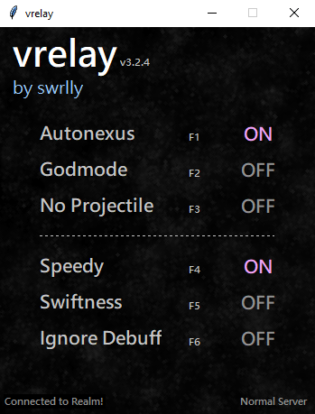

# vrelay

A man-in-the-middle proxy server for the Realm of the Mad God (RotMG) private server Valor. Features packet editing/hooking, a framework to write custom plugins, and many QoL plugins such as predictive autonexus.

**Updated for Valor version 3.2.6.**

  

## How to use

1. Install Python 64-bit. You can find installations of Python [here](https://www.python.org/downloads/). Install the 64-bit version or the GUI will not work.
2. Navigate to the right side of this page and look for `Releases`. Click on the latest release and download from `vrelay-v3.2.6.zip`. 
   - You can also clone this repository.
3. There is a folder called `normal` which contains the `Valor.swf` file for the normal server. Replace the original `Valor.swf` downloaded from Valor's website with the `Valor.swf` in this folder.
     - This `.swf` file has been modded so you can connect to the proxy server. If you only see `Valor`, that means you have your file extensions off.
4. Open the command line (type `Win ⊞ + r` and type in `cmd`, press enter. the command line will now be open), `cd` into the folder containing the code.
    - This will involve typing `cd C:\path\to\folder` then pressing enter. **Note**: you need to replace `C:\path\to\folder` with your path to vrelay.
    - If you downloaded the hack in another drive, such as `Z:` or `D:`, then you need to type the drive name (`Z:` or `D:`, respectively) in order to tell command prompt you wish to be in that drive.
5. Once you're in the folder in the command prompt, type `python proxy.py` in the command line to start the proxy. If you have previously installed Python, also try `py proxy.py` or `python3 proxy.py` if this does not work.
6. Connect to the proxy server in the server list and you're good to go.

## Features

Watch this video for a demonstration of some vrelay features: https://www.youtube.com/watch?v=V9N08Xuop4g

**Toggles**

Each feature has a toggle key as shown in the image above.

1. **Predictive Autonexus**: If you take damage that will put you under a certain threshold, you automatically join the nexus.
    - Accounts for most AoE's except for enemies with 2+ same color throws.
2. **Godmode**: Immune to all bullet and ground damage. Does not block AoE damage.
3. **No projectile**: Hides all projectiles from appearing; essentially another godmode (but very obvious to others as you do not know where to dodge).
    - Does not hide AoE damage (you will still take damage from AoE). 
4. **Speedy**: Apply speedy to yourself!
5. **Swiftness**: Apply swiftness (stronger form of Speedy) to yourself! Stacks with Speedy.
6. **Remove client-side debuffs**: This will remove client-side debuffs one tick after they are applied. These will not remove server-sided debuffs like bleeding, quiet, etc.
7. **Challenge/Normal mode**: This button (in the bottom right corner) will toggle between the proxy connecting to the challenge server or normal server.

**Player commands**

- `/dep`: deposit all potions into your potion storage. Can use this in any map.
- `/an #`: set autonexus % between 0 and 99. Enter only integers.
    - `/an help` in game to see the syntax.
- `/safe`: disable all commands shown above and autonexus messages.

## Writing your own plugins
[A README in the `plugins` folder](https://github.com/swrlly/vrelay/tree/main/Plugins) explains the necessary steps for writing plugins.

## Notes
I will not be liable for any claim, damages or other liability, whether in an action of contract, tort or otherwise, arising from, out of or in connection with the software or the use or other dealings in the software. You agree to use vrelay at your own risk and for educational purposes only.

This repository contains the latest RotMG Valor hacks and hacked client. If you are looking for RotMG Exalt hacks or a RotMG Unity hacked client this is not the place.

## Credits
- [JPEXS](https://www.free-decompiler.com/flash/download/) for reverse engineering and modifying the client. Huge help for being able to peek into the contents of `swf` files.
- This project is inspired by [KRelay](https://github.com/TheKronks/KRelay), an open source proxy for production RotMG.